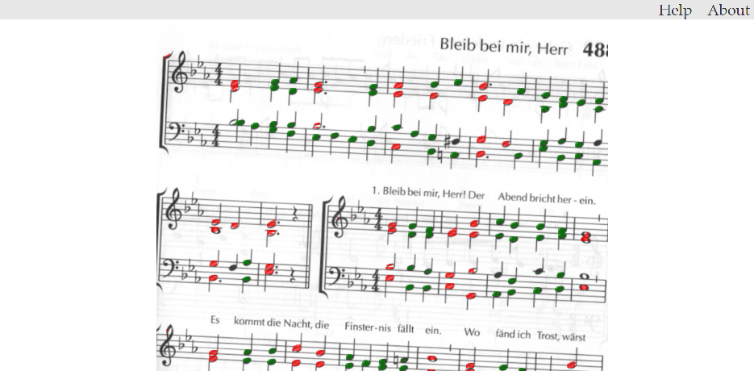

Aipollo aspires to be a robust optical music recognition web app. Users upload scanned sheet music and server-side neural networks turn them into symbolic representations of music that can be opened and edited with sheet music editors. The web app also allows users to correct any mistakes the neural networks make.

Aipollo uses [PyTorch](https://pytorch.org/) to train [U-Nets](https://arxiv.org/abs/1505.04597) on the [DeepScores dataset](https://tuggeluk.github.io/papers/preprint_deepscores.pdf). The web app is built using [Django](https://www.djangoproject.com/).

I work on Aipollo as a side project because it helps me to learn new things about web technologies and machine learning.

Aipollo is nowhere near finished. Currently, it 
* detects staff lines, half notes, and quarter notes;
* displays the output in a web app;
* allows users to correct the position of detected objects by drag-and-drop.

It cannot yet
* accept arbitrary scanned sheet music uploaded by the user;
* export to file formats that can be opened in sheet music editors;
* detect time signatures, accidentals, and many other kinds of musical symbols.